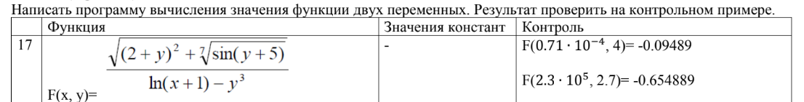

# Лабораторная работа 5: Вычисление математической функции

## 📋 Домашнее задание к работе №5

**Задание:** Создать программу вычисления указанной величины:


## 🧮 Алгоритм работы программы

1. **Инициализация и настройка локали**: 
   - Устанавливается русская локаль для корректного отображения текста
   - Подключаются необходимые библиотеки для математических вычислений

2. **Ввод пользовательских данных**:
   - Программа запрашивает у пользователя два числа: `x` и `y`
   - Введенные значения сохраняются в переменных типа `double` для точных вычислений

3. **Вычисление основной функции**:
   - Вычисляется числитель: квадратный корень из суммы:
     - Квадрата выражения `(2 + y)`
     - Седьмого корня из `sin(y + 5)`
   - Вычисляется знаменатель: разность:
     - Натурального логарифма `ln(x + 1)`
     - Куба числа `y`
   - Выполняется деление числителя на знаменатель

4. **Вывод результата**:
   - Результат вычислений выводится с точностью до 5 знаков после запятой

5. **Контрольные проверки**:
   - Программа автоматически проверяет два контрольных набора данных:
     - **Контроль №1**: `x = 0.71·10⁻⁴`, `y = 4.0`, `Ожидаемый результат = -0.09489`
     - **Контроль №2**: `x = 2.3·10⁵`, `y = 2.7`, `Ожидаемый результат = -0.654889`
   - Для каждого контрольного набора:
     - Выполняются те же вычисления
     - Результат сравнивается с ожидаемым значением
     - Выводится подробная информация о проверке

6. **Завершение работы**

## 📁 Структура репозитория
Lab5/

├── Home_Task.c   - # Исходный код программы

└── README.md

## 📝 Исходный код

```c
#define _CRT_SECURE_NO_WARNINGS
#include <stdio.h>
#include <locale.h>
#include <math.h>

int main() {
    setlocale(LC_CTYPE, "RUS");
    double x, y, result;

    printf("Введите x: ");
    scanf("%lf", &x);
    printf("Введите y: ");
    scanf("%lf", &y);

    result = sqrt(pow(2 + y, 2) + pow(sin(y + 5), 1.0 / 7.0)) / (log(x + 1) - pow(y, 3));
    printf("F(%.2f, %.2f) = %.5f\n\n", x, y, result);

    double x_test = 0.71 * pow(10, -4);
    double y_test = 4.0;
    double control_result = sqrt(pow(2 + y_test, 2) + pow(sin(y_test + 5), 1.0 / 7.0)) / (log(x_test + 1) - pow(y_test, 3));
    printf("Контроль №1: \n");
    printf("F(%.7f, %.1f) = %.5f\n", x_test, y_test, control_result);
    printf("Ожидаемый результат: -0.09489\n\n");

    double x_test2 = 2.3 * pow(10, 5);
    double y_test2 = 2.7;
    double control_result2 = sqrt(pow(2 + y_test2, 2) + pow(sin(y_test2 + 5), 1.0 / 7.0)) / (log(x_test2 + 1) - pow(y_test2, 3));
    printf("Контроль №2: \n");
    printf("F(%.7f, %.1f) = %.6f\n", x_test2, y_test2, control_result2);
    printf("Ожидаемый результат: -0.654889\n");
    return 0;
}
```
## Автор:
Чапэ Максим Сергеевич

Группа: бТИИ - 251
